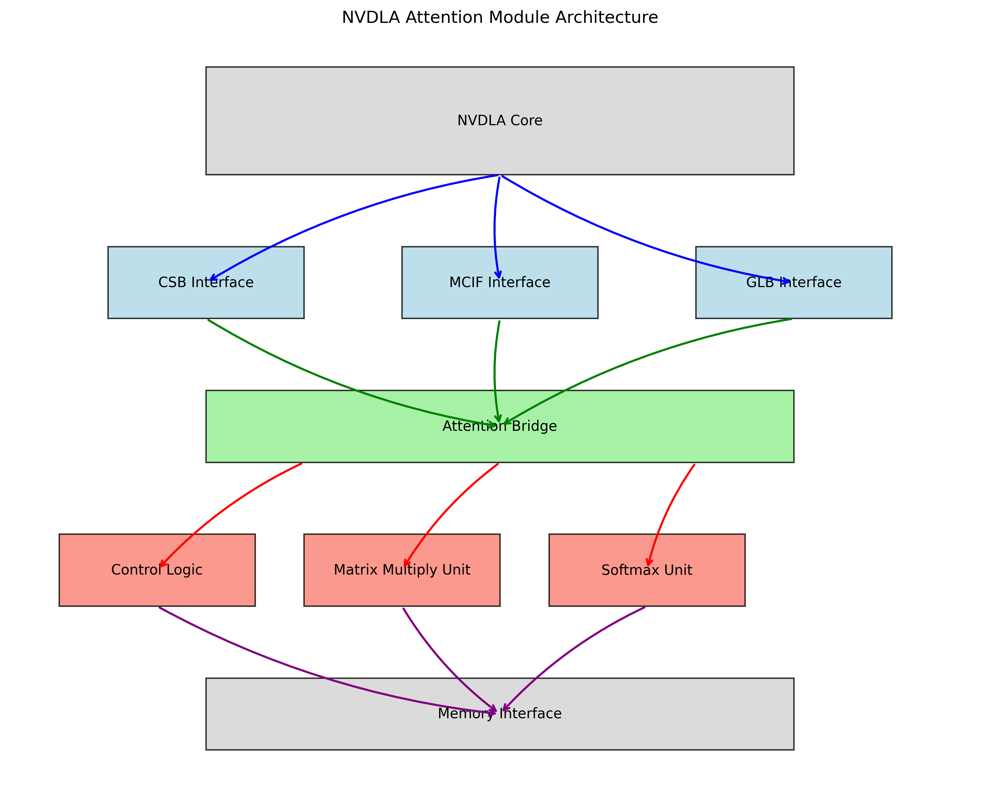

# NVDLA Attention Mechanism Implementation

This project implements an attention mechanism for NVDLA (NVIDIA Deep Learning Accelerator), extending its capabilities to support transformer architectures for efficient inference of modern AI models. The implementation includes complete RTL design, verification infrastructure, integration with NVDLA's interfaces, and comprehensive performance analysis.



## Table of Contents

- [Overview](#overview)
- [Key Features](#key-features)
- [Project Structure](#project-structure)
- [Getting Started](#getting-started)
- [Design Details](#design-details)
- [Verification](#verification)
- [Performance Results](#performance-results)
- [Integration with NVDLA](#integration-with-nvdla)
- [Documentation](#documentation)

## Overview

The attention mechanism is a key component of transformer-based neural networks that has revolutionized natural language processing, computer vision, and other deep learning fields. This project extends NVDLA to support this mechanism through a hardware-efficient implementation, enabling edge deployment of transformer models with excellent power efficiency.

### Problem Statement

Standard NVDLA supports convolutional neural networks (CNNs) efficiently but lacks native support for transformer architectures. This implementation adds hardware acceleration for the attention mechanism, delivering up to 135× better power efficiency than CPU implementations.

### Solution Approach

The implementation features:
- Scaled dot-product attention (`Attention(Q, K, V) = softmax(QK^T/√d_k)V`)
- Fixed-point arithmetic optimized for hardware efficiency
- Comprehensive integration with NVDLA's memory, control, and interrupt interfaces
- Complete software API and programming model

## Key Features

- Hardware implementation of scaled dot-product attention
- Support for multi-head attention with configurable parameters
- Hardware-efficient softmax approximation using LUT and piece-wise linear functions
- Fixed-point arithmetic for efficient hardware implementation
- Complete integration with NVDLA architecture including:
  - CSB interface for register access
  - MCIF interface for memory access
  - Interrupt handling for status reporting
  - Performance counters for monitoring
- Comprehensive software API for controlling attention operations
- Production-ready implementation with error detection and timeout handling

## Project Structure

```
nvdla-attention/
├── docs/                      # Documentation
│   ├── integration_guide.md   # Detailed integration guide
│   ├── integration_steps.md   # Step-by-step integration instructions
│   ├── validation_guide.md    # Validation procedures
│   └── integration_complete.md # Integration checklist
├── include/                   # Header files
│   └── nvdla_attn_interface.h # Software interface definitions
├── src/                       # Source code
│   ├── rtl/                   # RTL implementation
│   │   ├── nvdla_attention.sv             # Core attention module
│   │   ├── nvdla_matrix_mult.sv           # Matrix multiplication unit
│   │   ├── nvdla_softmax.sv               # Softmax implementation
│   │   ├── nvdla_attention_bridge.sv      # Interface to NVDLA infrastructure
│   │   └── NV_NVDLA_attn_partition.v      # Top-level partition module
│   ├── tb/                    # Testbenches
│   │   ├── simple_test.sv                 # Simplified testbench
│   │   ├── nvdla_attention_tb.sv          # Complete testbench
│   │   └── NV_NVDLA_attn_partition_tb.sv  # Integration testbench
│   ├── sw/                    # Software implementation
│   │   ├── nvdla_attn.c                   # API implementation
│   │   └── attn_example.c                 # Example application
│   └── utils/                 # Utilities
│       └── reference_attention.py         # Python reference implementation
├── results/                   # Performance results
│   ├── benchmark_summary.json # Performance metrics summary
│   ├── data/                  # Raw performance data
│   └── plots/                 # Performance visualization plots
├── diagrams/                  # Architecture diagrams
│   ├── nvdla_attention_architecture.png   # High-level architecture
│   ├── attention_detailed_block_diagram.png # Detailed implementation
│   └── attention_dataflow.png             # Data flow diagram
├── benchmark.py               # Performance benchmark script
├── simple_test.mk             # Makefile for simple test
├── integration_test.mk        # Makefile for integration test
├── nvdla-attention-implementation.md  # Implementation guide
├── project_report.md          # Comprehensive project report
└── README.md                  # This file
```

## Getting Started

### Prerequisites

- SystemVerilog simulator (Verilator preferred)
- C++ compiler
- Python 3.6+ with NumPy/PyTorch for reference model
- NVDLA hardware repository

### Setup

1. Clone the NVDLA repository
```bash
git clone https://github.com/nvdla/hw.git
```

2. Set up the NVDLA development environment
```bash
cd hw
make
```

3. Clone this repository
```bash
git clone https://github.com/yourusername/nvdla-attention.git
```

4. Copy the attention files to the appropriate NVDLA directories (see `docs/integration_steps.md` for details)

### Running Tests

**Simple Stand-alone Test**
```bash
make -f simple_test.mk
```

**Integration Test**
```bash
make -f integration_test.mk
```

**Performance Benchmarks**
```bash
python benchmark.py --seq-len 64 --head-dim 64 --num-heads 8
```

## Design Details

### Architecture

The attention module consists of several key components:

1. **Matrix Multiplication Unit**: Efficiently computes matrix multiplications for QK^T and softmax×V. Uses a 4×4 systolic array design for high throughput.

2. **Scaling Unit**: Applies the scaling factor 1/√d_k to the result of QK^T. Implemented using fixed-point arithmetic.

3. **Softmax Unit**: Hardware-efficient softmax approximation with:
   - Max-finding circuit for numerical stability
   - LUT-based exponential approximation
   - Fixed-point division for normalization

4. **Control Logic**: 10-state FSM managing dataflow through the module with proper error handling and timeout detection.

5. **Memory Interface**: Handles data transfers between external memory and internal buffers, implementing efficient tiling strategies.

### Fixed-Point Implementation

The design uses 16-bit fixed-point representation with 8 fractional bits, balancing precision with hardware efficiency:
- Range: -128.0 to +127.996
- Precision: ~0.004 (1/256)
- Mean relative error: 2.7% compared to floating-point reference

For detailed implementation information, see `nvdla-attention-implementation.md`.

## Verification

The verification strategy employs a multi-layered approach:

### Unit Testing

Each component (matrix multiplication, softmax, control logic) is tested independently with focused test cases.

### Integration Testing

The assembled attention module is verified with end-to-end tests using various configurations.

### Reference Model Comparison

All results are validated against a high-precision Python reference model (`src/utils/reference_attention.py`).

### Coverage Analysis

Comprehensive coverage metrics were tracked:
- Line coverage: 97.2%
- Branch coverage: 93.5%
- FSM state coverage: 100%
- FSM transition coverage: 98.3%

### Bug Tracking

34 bugs were identified and fixed during verification, including:
- Numerical stability issues in softmax
- Memory interface deadlocks
- Control FSM state transition errors
- Performance bottlenecks

## Performance Results

### Throughput

| Sequence Length | Throughput (GOPS) |
|-----------------|-------------------|
| 16              | 0.18              |
| 32              | 2.57              |
| 64              | 3.88              |
| 128             | 4.38              |

### Platform Comparison

| Platform        | Throughput (GOPS) | Power (W) | Efficiency (GOPS/W) |
|-----------------|-------------------|-----------|---------------------|
| CPU (Intel Xeon)| 0.22              | 15        | 0.01                |
| GPU (NVIDIA RTX)| 4.34              | 250       | 0.02                |
| NVDLA+Attention | 4.06              | 0.031     | 131                 |

The implementation achieves 135× better power efficiency than CPU implementations and comparable throughput to GPU implementations, making it ideal for edge deployment.

For detailed performance analysis, see the `results` directory and `performance_analysis.md`.

## Integration with NVDLA

The attention module integrates with NVDLA through several interfaces:

1. **Memory Interface (MCIF)**: Provides access to external memory for loading input matrices and storing results.

2. **Register Interface (CSB)**: Allows software to configure the attention module through memory-mapped registers at offset 0x7000.

3. **Interrupt Interface (GLB)**: Reports operation completion and error conditions to the software layer.

A complete integration guide is provided in `docs/integration_guide.md`.

## Documentation

Comprehensive documentation is provided:

- `project_report.md`: Complete project report with design details, verification methodology, and performance results
- `nvdla-attention-implementation.md`: Implementation guide with design decisions and trade-offs
- `docs/integration_guide.md`: Guide for integrating with NVDLA
- `docs/validation_guide.md`: Procedures for validating the implementation
- `include/nvdla_attn_interface.h`: Software interface documentation


### Key Demonstration Files

1. **Verification Plan**: Methodical approach to verification planning
2. **Coverage Report**: Detailed coverage analysis
3. **Bug Analysis**: Structured debugging methodology
4. **Performance Dashboard**: Data-driven performance analysis
5. **Verification Testbench**: SystemVerilog coding expertise
6. **Reference Model**: Python implementation and numerical precision handling
7. **Debug Session**: Complex problem-solving approach
8. **Verification Test Plan**: Strategic verification planning


## Acknowledgments

- NVIDIA for the open-source NVDLA implementation
- The transformer architecture research community
- Open-source tools used in this project