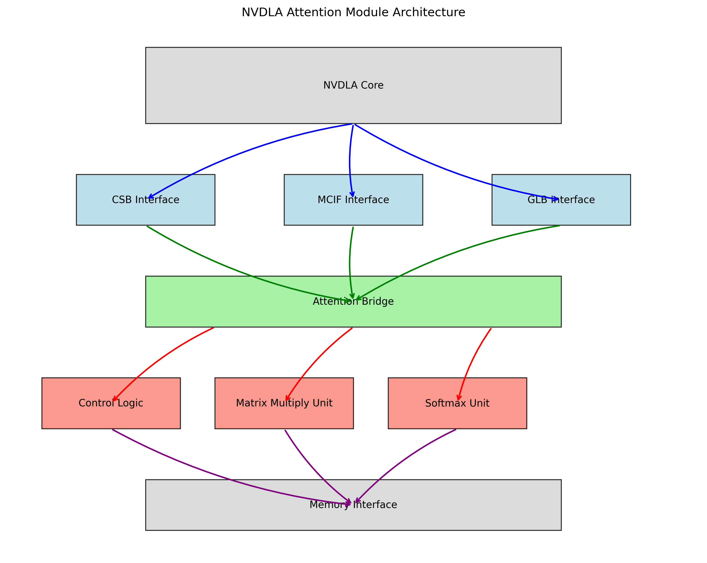

# Diagrams

This document contains all the diagrams used in this project along with brief descriptions.

## Area Breakdown

*Description*: Provides an in-depth breakdown of various areas within the design.

## Attention Dataflow

*Description*: Shows the dataflow within the attention mechanism.

## Attention Detailed Block Diagram

*Description*: A detailed block diagram of the attention mechanism.

## Attention Module Architecture

*Description*: Details the structure and flow of the attention module within the system.

## Control State Machine

*Description*: Represents the control state machine for the system.

## Error Distribution

*Description*: Visualizes the error distribution across different components.

## Matrix Multiplication Unit

*Description*: Diagram of the matrix multiplication unit used in the design.

## NVDLA Attention Architecture

*Description*: High-level architecture of the NVDLA attention mechanism.

## NVDLA Integration Points

*Description*: Highlights the integration points of the attention mechanism within the NVDLA framework.

## Performance Comparison Chart

*Description*: Compares the performance of the attention mechanism against other implementations.

## Power Breakdown

*Description*: Provides a breakdown of power consumption across different components.

## Power Efficiency Comparison

*Description*: Compares the power efficiency of the attention mechanism with other designs.

## Scaling Chart

*Description*: Illustrates the scaling behavior of the attention mechanism.

## Softmax Unit

*Description*: Diagram of the softmax unit used in the attention mechanism.

## Top-Level Architecture

*Description*: The top-level architecture of the entire system.